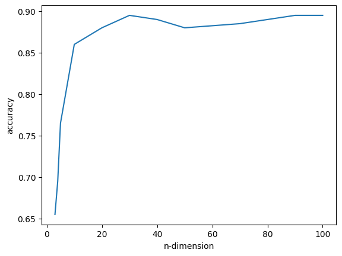
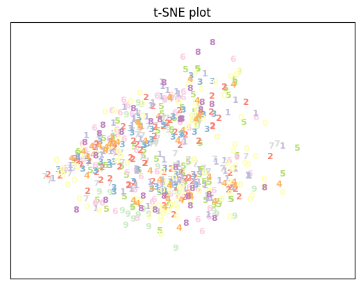

张峪齐 3200105176

### 第一题

#### 题目

利用PCA 进行面部识别

第一步：从https://pan.zju.edu.cn/share/4f8a7baa9837d15018d462e9a4 下载数据。

第二步：加载数据

第三步：降维

第四步：建立分类模型

第五步：性能度量（比较降维前后性能的差异）

#### 解答

##### 加载数据


```python
import cv2
import numpy as np
def loadData(path):
    '''
    该函数传入数据集文件夹路径，返回数据集
    返回的数据集为一个numpy矩阵，其中每一行是一个图像的数据
    '''
    dataSet=np.array([])
    dataset=[]
    classVec=[]
    for i in range(1,41):
        path0=path+'/s'+str(i)
        for j in range(1,11):
            path_bmp=path0+'/'+str(j)+'.bmp'
            #dataSet[(i-1)*10+j,:]=cv2.imread(path_bmp,0).reshape(1,-1)
            dataset.append(cv2.imread(path_bmp,0).flatten())
            dataSet=np.mat(np.array(dataset,dtype="uint8"))
            classVec.append(i)
            #print(img.shape)  #所有图片的shape都是(112,92)        
    #print(f"dataSet.shape={dataSet.shape}")
    return dataSet,np.array(classVec)

dataSet,classVec=loadData('./orl')
```

##### 降维

计算协方差矩阵的特征值将花费极长的时间（可能是在本例中协方差矩阵不满秩？）故改为使用奇异值分解


设一个数据集有m个n维数据，表示为矩阵$X_{m \times n}$

该矩阵的SVD为：$X_{m \times n} = U_{m \times m} \Sigma _{m \times n} V_{n \times n}^T$ (若考虑复数则为$V_{n \times n}^H$)

又：使用```np.cov(X,rowvar=0)```计算X的协方差矩阵，结果为$X^TX$

则有$X_{n \times m}^TX_{m \times n}=V_{n \times n} \Sigma _{n \times m}^T \Sigma _{m \times n} V_{n \times n}^T$

则可以发现，X的右奇异向量矩阵v就是X协方差矩阵的特征向量矩阵

另外，奇异值矩阵$\Sigma _{m \times n}$中的奇异值序列自然是有序排列的,省去了排序

由此我们可以将示例代码中做如下修改，将代码片段：

```
covMat = np.cov(meanRemoved, rowvar=0)#计算协方差矩阵
eigVals,eigVects = np.linalg.eig(np.mat(covMat))                    
eigValInd = np.argsort(eigVals) #sort, sort goes smallest to largest
eigValInd = eigValInd[:-(topNfeat+1):-1] #cut off unwanted dimensions
redEigVects = eigVects[:,eigValInd] #reorganize eig vects largest to smallest
```

改为：

```
u, s, vh = np.linalg.svd(dataMat)
v=vh.T
redEigVects = v[:,:topNfeat]

```
由于只有400个奇异值，因此可以想到topNfeat取400以内才是有意义的


```python
def pca(dataMat, topNfeat=9999999):
    '''
    参数：数据集矩阵，取主要特征的数量
    返回：以主成分表示的数据集矩阵
    '''
    meanVals = np.mean(dataMat, axis=0)
    meanRemoved = dataMat - meanVals #标准化
    
    u, s, vh = np.linalg.svd(meanRemoved)
    v=vh.T
    #print(s)
    redEigVects = v[:,:topNfeat]
    print(f"所选特征值和占总特征值和之比{sum(s[:topNfeat]**2)/sum(s**2)}")
    #covMat = np.cov(meanRemoved, rowvar=0)#计算协方差矩阵, np.cov(X,rowvar=0) = (X^T)X
    #eigVals,eigVects = np.linalg.eig(np.mat(covMat))                    
    #print(eigVals.shape)
    #print(eigVals)
    #eigValInd = np.argsort(eigVals) #sort, sort goes smallest to largest
    #eigValInd = eigValInd[:-(topNfeat+1):-1] #cut off unwanted dimensions
    #redEigVects = eigVects[:,eigValInd] #reorganize eig vects largest to smallest
    lowDDataMat = meanRemoved * redEigVects#transform data into new dimensions
    reconMat = (lowDDataMat * redEigVects.T) + meanVals
    return lowDDataMat, reconMat
    
pca(dataSet,100)

#test=np.mat([[-2,-3,1],[2,3,-1]])
#test_cov=np.cov(test,rowvar=0)
#print(test)
#print("\n")
#print(test_cov)
#print("\n")
#print(np.linalg.svd(test))
#print("\n")
#print(np.linalg.eig(test_cov))
```

    所选特征值和占总特征值和之比0.8905796822623977


    (matrix([[-1531.17604911,  1072.18126719, -1867.02575339, ...,
                -29.8451226 ,   103.89477659,   -95.40523457],
             [-2975.89645415,   759.88308519,   461.81166493, ...,
                 33.90952267,    70.44235595,   119.3806765 ],
             [-2696.44921967,   380.51575337, -1004.96184044, ...,
                 12.01506814,   -40.74426834,   131.05164774],
             ...,
             [ -843.14794032,   949.73439324,  1541.14202448, ...,
                -62.05280966,   123.22484457,   148.03585803],
             [-1400.61765833,  1276.41046965,   806.91098888, ...,
               -131.91627014,    45.13411479,    63.6797419 ],
             [ -534.83465374,   476.89207046,  2058.98859097, ...,
                 -9.88220458,   204.38033356,     4.25254952]]),
     matrix([[ 50.37614075,  50.47239725,  51.36679253, ...,  43.40426149,
               39.08335592,  32.51565371],
             [ 67.80081274,  71.61023321,  76.02869058, ...,  18.81029243,
               28.05415364,  18.01340539],
             [ 45.56303531,  48.78145281,  49.71171724, ...,  34.19881602,
               22.76279017,  28.8756073 ],
             ...,
             [114.90238516, 114.64426911, 116.34598063, ...,  35.80904326,
               39.37454781,  39.77195234],
             [119.12682325, 121.28301702, 121.59024055, ..., 104.65186007,
              106.55261309, 106.75370366],
             [127.24869403, 124.90127049, 124.06077942, ...,  38.15029717,
               43.57659454,  49.54457848]]))


##### 建立分类模型

划分训练数据与测试数据


```python
from sklearn.model_selection import train_test_split
X_train, X_test, y_train, y_test = train_test_split(dataSet, classVec, random_state=2023)

```

使用sklearn训练KNN模型进行分类，并测试准确率


```python
from sklearn.neighbors import KNeighborsClassifier
def knn_by_sklearn(X_train,y_train,X_test,y_test,k):
    X_tr=np.array(X_train)
    X_te=np.array(X_test)
    neigh=KNeighborsClassifier(n_neighbors=k)
    neigh.fit(X_tr,y_train)
    y_predict=neigh.predict(X_te)
    
    #统计准确率
    error=0
    for i in range(0,len(y_predict)):
        if y_predict[i]!=y_test[i]:
            error=error+1
            #print(f"错误地将第 {y_test[i]} 人识别为第 {y_predict[i]} 人")
    accuracy=1-error/len(y_predict)
    
    return y_predict,accuracy
```

##### 性能度量

使用一半的数据作为训练数据，另一半作为测试数据。
同时，只考虑一个最近邻居

测试结果如下


```python
import matplotlib.pyplot as plt

plt.figure()
k_values=[3,4,5,10,20,30,40,50,70,90,100]
accuracy_values=[]
for k in k_values:
    print(f"\n选取前{k}重要的特征与1个最近邻")
    dataSet,classVec=loadData('./orl')
    lowDData, dataSet=pca(dataSet,k)
    X_train, X_test, y_train, y_test = train_test_split(lowDData, classVec,test_size=0.5,random_state=2023)
    y_predict,accuracy=knn_by_sklearn(X_train,y_train,X_test,y_test,1)
    
    print("识别准确率为:")
    print(accuracy)
    accuracy_values.append(accuracy)
plt.plot(k_values,accuracy_values)
plt.xlabel("n-dimension")
plt.ylabel("accuracy")


```


    选取前3重要的特征与1个最近邻
    所选特征值和占总特征值和之比0.3735722850448564
    识别准确率为:
    0.655
    
    选取前4重要的特征与1个最近邻
    所选特征值和占总特征值和之比0.429361713478342
    识别准确率为:
    0.6950000000000001
    
    选取前5重要的特征与1个最近邻
    所选特征值和占总特征值和之比0.4804608403301748
    识别准确率为:
    0.765
    
    选取前10重要的特征与1个最近邻
    所选特征值和占总特征值和之比0.5995186153355094
    识别准确率为:
    0.86
    
    选取前20重要的特征与1个最近邻
    所选特征值和占总特征值和之比0.7001464675567806
    识别准确率为:
    0.88
    
    选取前30重要的特征与1个最近邻
    所选特征值和占总特征值和之比0.7532803802172332
    识别准确率为:
    0.895
    
    选取前40重要的特征与1个最近邻
    所选特征值和占总特征值和之比0.7894503592571361
    识别准确率为:
    0.89
    
    选取前50重要的特征与1个最近邻
    所选特征值和占总特征值和之比0.8160502357792211
    识别准确率为:
    0.88
    
    选取前70重要的特征与1个最近邻
    所选特征值和占总特征值和之比0.8535664947576844
    识别准确率为:
    0.885
    
    选取前90重要的特征与1个最近邻
    所选特征值和占总特征值和之比0.8798769527705115
    识别准确率为:
    0.895
    
    选取前100重要的特征与1个最近邻
    所选特征值和占总特征值和之比0.8905796822623977
    识别准确率为:
    0.895


    Text(0, 0.5, 'accuracy')


​    

​    


### 第二题


#### 题目

利用SVM自然图片分类（实验手册练习Chars74K 数据集）

### 解答

##### 导入数据集


```python
import os
import numpy as np
from sklearn.pipeline import Pipeline
from sklearn.svm import SVC
#from thundersvm import SVC
from sklearn.model_selection import train_test_split
from sklearn.model_selection import GridSearchCV
from sklearn.metrics import classification_report
from PIL import Image
X = []
y = []
for path, subdirs, files in os.walk('./English/Img/GoodImg/Bmp/'):
    for filename in files:
        f = os.path.join(path, filename)
        target = filename[3:filename.index('-')]
        img = Image.open(f).convert('L').resize((30, 30), resample=Image.LANCZOS)
        X.append(np.array(img).reshape(900,))
        y.append(target)
X = np.array(X)
print(X.shape)
print(X)
print(len(set(y)))

```


    (7705, 900)
    [[158 154 157 ... 149 149 150]
     [162 161 162 ... 151 153 149]
     [127 127 128 ... 109 119 125]
     ...
     [ 54  52  52 ...  50  48  46]
     [ 36  50  54 ...  44  42  42]
     [ 50  50  49 ... 138  76  33]]
    62


##### 从零实现SVM在自然图片上的分类

##### 使用sklearn实现分类识别


```python
X = X/255.0*2 - 1
X_train, X_test, y_train, y_test = train_test_split(X, y, test_size = 0.2, random_state=11)

pipeline = Pipeline([('clf', SVC(kernel='rbf', gamma=0.01, C=100))])
parameters = {
    'clf__gamma': (0.01, 0.03, 0.1, 0.3, 1),
    'clf__C': (0.1, 0.3, 1, 3, 10, 30),
}

grid_search = GridSearchCV(pipeline, parameters, n_jobs=2, verbose=1, scoring='accuracy')
grid_search.fit(X_train[:5000], y_train[:5000])
print('Best score: %0.3f' % grid_search.best_score_)
print('Best parameters set:')

best_parameters = grid_search.best_estimator_.get_params()
for param_name in sorted(parameters.keys()):
    print('\t%s: %r' % (param_name, best_parameters[param_name]))

predictions = grid_search.predict(X_test)
print(classification_report(y_test, predictions))
```

```
Fitting 5 folds for each of 30 candidates, totalling 150 fits
Best score: 0.573
Best parameters set:
clf__C: 10
clf__gamma: 0.01
precision recall f1-score support
001 0.53 0.30 0.38 27
002 0.73 0.44 0.55 18
003 0.67 0.33 0.44 18
004 0.60 0.43 0.50 7
005 1.00 0.25 0.40 12
006 1.00 0.18 0.31 11
007 0.80 0.36 0.50 11
008 1.00 0.50 0.67 8
009 0.00 0.00 0.00 3
010 0.50 0.33 0.40 3
011 0.67 0.95 0.78 119
012 0.36 0.38 0.37 21
013 0.69 0.73 0.71 45
014 0.73 0.59 0.65 46
015 0.61 0.87 0.72 86
016 0.64 0.50 0.56 14
017 0.65 0.41 0.50 32
018 0.64 0.60 0.62 30
019 0.63 0.77 0.69 70
020 0.38 0.20 0.26 15
021 0.62 0.50 0.56 10
022 0.84 0.78 0.81 49
023 0.88 0.67 0.76 33
024 0.75 0.95 0.83 56
025 0.42 0.64 0.51 81
026 0.78 0.71 0.75 35
027 0.00 0.00 0.00 4
028 0.57 0.83 0.68 89
029 0.35 0.77 0.48 60
030 0.65 0.85 0.74 59
031 0.67 0.43 0.52 14
032 0.67 0.57 0.62 21
033 0.86 0.50 0.63 12
034 0.83 0.33 0.48 15
035 0.80 0.27 0.40 15
036 0.60 0.38 0.46 8
037 0.72 0.64 0.68 36
038 1.00 0.40 0.57 5
039 0.40 0.14 0.21 14
040 0.80 0.33 0.47 12
041 0.79 0.68 0.73 50
042 0.00 0.00 0.00 6
043 0.00 0.00 0.00 4
044 1.00 0.44 0.61 16
046 1.00 0.17 0.29 6
047 0.00 0.00 0.00 8
048 0.75 0.50 0.60 6
049 0.50 0.20 0.29 5
050 0.68 0.60 0.64 25
051 0.29 0.17 0.21 42
052 0.00 0.00 0.00 10
053 0.00 0.00 0.00 9
054 0.77 0.77 0.77 26
055 0.46 0.29 0.35 21
056 0.86 0.67 0.75 27
057 0.50 0.50 0.50 4
058 1.00 0.17 0.29 6
059 0.00 0.00 0.00 3
060 0.00 0.00 0.00 4
061 1.00 0.17 0.29 6
062 1.00 0.33 0.50 6
accuracy 0.62 1541
macro avg 0.60 0.42 0.46 1541
weighted avg 0.63 0.62 0.60 1541
```


##### 使用tSNE可视化数据的分布


```python
from matplotlib import pyplot as plt
from time import time
from sklearn.manifold import TSNE


t_start=time()
tsne = TSNE(n_components=2,perplexity=40.0,early_exaggeration=20.0,learning_rate=10,init="pca",n_iter=3000)
result=tsne.fit_transform(X)
t_end=time()
print(f"tSNE降维耗时：%.2g sec" %(t_end-t_start))

# y=[int(item) for item in y]

```

    tSNE降维耗时：2.3e+02 sec


```python
def plot_embedding(data, label, title):
    x_min, x_max = np.min(data, 0), np.max(data, 0)
    data = (data - x_min) / (x_max - x_min)

    fig = plt.figure()
    for i in range(data.shape[0]):
        if(int(label[i])<11):
            plt.text(data[i, 0], data[i, 1], chr(ord('0')-1+int(label[i])),
                 color=plt.cm.Set3(int(label[i])),
                 fontdict={'weight': 'bold', 'size': 9})
    plt.xticks([])
    plt.yticks([])
    plt.title(title)
    return fig

figure=plot_embedding(result,y,"t-SNE plot")
plt.show(figure)

```


​    

​    

